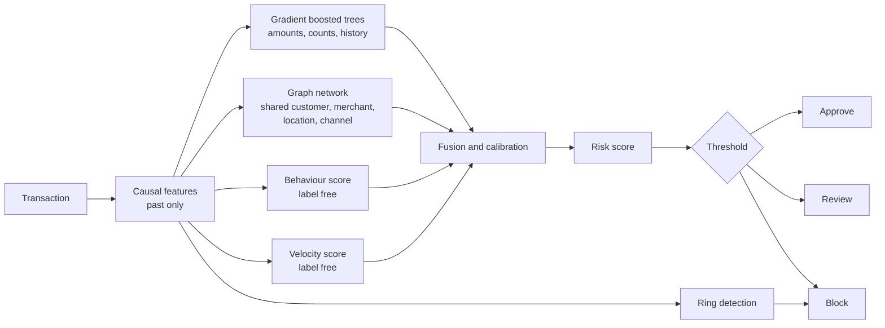
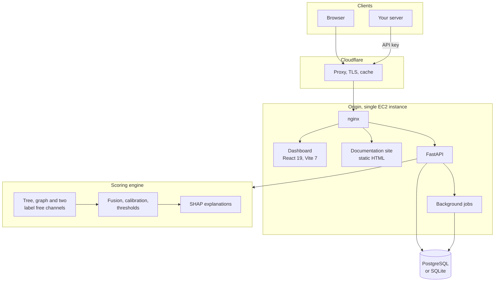
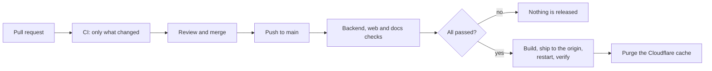

<div align="center">

<picture>
  <source media="(prefers-color-scheme: dark)" srcset="assets/banner.png">
  
</picture>

<br>

**An AI risk manager for payment fraud.**

Spark scores every transaction, finds the accounts working together behind the
obvious ones, and shows the evidence for every decision it makes.

<br>

[](https://github.com/spacesdrive/spark/actions/workflows/ci.yml)
[](https://github.com/spacesdrive/spark/actions/workflows/deploy.yml)
[](https://www.python.org/downloads/)
[](https://react.dev/)
[](#testing)

**[Live dashboard](https://spark.spacesdrive.cc)**
 · **[Documentation](https://docs-spark.spacesdrive.cc)**
 · **[API reference](docs/developers/api.md)**
 · **[Results](docs/using-spark/evaluation.md)**

</div>

---

## Why Spark exists

A single suspicious payment is the easy case. Any model catches it.

The expensive case is a ring: twenty fresh accounts, small amounts, one
merchant, one payment channel, all inside a few minutes. Every payment passes
inspection on its own. The pattern exists only in the relationships between
them, and by the time the chargebacks arrive the money is gone.

Spark looks at both. It scores the transaction, and it scores the company that
transaction keeps.

Two rules run through the whole system:

**A transaction only ever sees its own past.** Features for transaction 10 are
built from transactions 0 to 9 and nothing later. Graph edges point only from
older to newer. A confirmed fraud outcome does not become usable the instant it
happens, because in reality a chargeback arrives weeks after the payment.

**Nothing is invented.** When a number has not been measured, every surface
says so rather than showing a placeholder. That applies to the dashboard, the
API and this README.

## Try it in one minute

No account, no key, no setup:

```bash
curl -X POST https://spark.spacesdrive.cc/api/risk/score \
  -H 'Content-Type: application/json' \
  -d '{"amount": 0.95, "customer_id": "S31249", "merchant_id": "T1822"}'
```

```json
{
  "risk_score": 0.2143,
  "risk_band": "high",
  "decision": "block",
  "reasons": [
    { "text": "account first seen 20817 time units ago", "direction": "increases" },
    { "text": "amount ends in 95 cents", "direction": "increases" }
  ],
  "related_ring": { "n_accounts": 8, "merchant": "T1822" },
  "latency_ms": 18.4
}
```

Or open the [dashboard](https://spark.spacesdrive.cc), pick the
"Looks like a ring" example, and read the decision, the reasons and the earlier
transactions Spark linked it to.

## Run it locally

```bash
pip install -r requirements.txt
python -m spark.data.fetch      # download the dataset
python -m ml.training.train     # train, about 70 seconds on a laptop CPU
python -m spark.demo            # run everything and print the results
```

For the dashboard, two processes:

```bash
cp .env.example .env
uvicorn api.main:app --reload            # terminal 1

npm --prefix web install
npm --prefix web run dev                 # terminal 2
```

Open <http://localhost:5173>. Scoring a transaction, uploading a dataset and
reading the evaluation all work without an account.

## How a decision is made



Four scores are produced for every transaction and blended into one.

| Channel | What it reads | Uses fraud labels |
| --- | --- | --- |
| Tree model | Amounts, counts, entity history | Yes |
| Graph model | Transactions sharing a customer, merchant, location or channel | Yes |
| Behaviour | How unusual this is for this account | No |
| Velocity | How fast and how concentrated recent activity is | No |

The last two read no labels at all, so they keep working during the weeks
before chargebacks arrive. The blend weights were found by searching 400
combinations on validation data, not chosen by hand.

## Architecture



The API wraps the existing scoring engine rather than reimplementing it, so the
dashboard, the SDKs and the command line can never disagree about a score.

The dashboard, the documentation and `/api` are served from one hostname on
purpose: the session cookie is `SameSite`, and splitting the origin would break
sign-in.

## Results

Measured on the held-out test split, read once after every weight and threshold
was already fixed. 5,100 labeled transactions, 43.9 percent fraud.

<table>
<tr><th align="left">Transaction scoring, balanced setting</th><th align="left">Ring detection, no labels used</th></tr>
<tr valign="top"><td>

| Metric | Value |
| --- | --- |
| PR-AUC | 0.9151 |
| ROC-AUC | 0.9473 |
| Precision | 0.6299 |
| Recall | 0.9911 |
| F1 | 0.7703 |
| False positive rate | 0.4553 |
| False negative rate | 0.0089 |

</td><td>

| Metric | Value |
| --- | --- |
| Precision | 0.9189 |
| Recall | 0.8963 |
| Rings alerted | 3 |

Confusion matrix for scoring:
TP 2,218, FP 1,303, FN 20, TN 1,559.

</td></tr>
</table>

### Speed

| Operation | Time |
| --- | --- |
| Score one transaction | about 1.8 ms |
| With explanation | about 8 ms |
| Through the API, including the explanation | about 20 ms |
| Batch scoring | about 29,000 per second |
| Training from scratch | about 70 seconds |

One laptop CPU. Reproduce with `python -m spark.demo`. The graph model uses CPU
float maths that is not perfectly repeatable, so retraining moves these numbers
by about 0.001.

### Thresholds are chosen by cost, not by accuracy

Blocking a real customer costs a sale and a relationship. Missing fraud costs
the money. Those are not the same, so a single accuracy number cannot pick a
threshold.

```
false positive     25.0 per blocked good order
missed fraud       the full amount, plus 15.0
manual review      3.0 per review, catches 80 percent of the fraud sent to it
```

At the balanced setting on the test split:

| | Value |
| --- | --- |
| Loss with no system | 55,778.38 |
| Prevented loss | 54,170.31 |
| Cost of running the system | 34,468.07 |
| **Net benefit** | **21,310.31** |

## Using it

### Dashboard

Everything in this table works without an account.

| Page | What it does |
| --- | --- |
| Overview | What Spark does, the measured results, and the limits |
| Transaction | Score one transaction and read the evidence behind it |
| Dataset | Upload a CSV, score every row, download the results |
| Risk analysis | The full evaluation, split by split |
| Abuse rings | Detected rings and how they were scored |
| Models | Which models exist and what each one actually scored |
| Developers | Endpoint reference and a live sandbox |
| Documentation | Plain-language guide and glossary |

An account adds organizations, private datasets, API keys, usage reporting and
custom model training.

### SDKs

```python
from spark_sdk import Spark

spark = Spark(api_key="sk_test_...")
result = spark.score(amount=249.0, customer_id="cus_18", merchant_id="mer_7")

if result.decision == "block":
    print(result.reasons[0].text)
```

```typescript
import { Spark } from "@spark-ai/sdk";

const spark = new Spark({ apiKey: process.env.SPARK_API_KEY });
const result = await spark.score({
  amount: 249.0,
  customerId: "cus_18",
  merchantId: "mer_7",
});
```

Neither client will print your key. The Python `repr` and the Node `toJSON`
omit it, so logging a client cannot leak the credential.

### Upload your own data

Spark checks your columns, explains any problem in a sentence you can act on,
scores every row as a background job, and lets you download the results.

If your file records what actually happened, Spark measures precision, recall,
F1, PR-AUC, ROC-AUC, the confusion matrix and the expected cost on your rows.
If it does not, Spark says so and shows no accuracy numbers at all.

## Documentation

Full documentation is at
[docs-spark.spacesdrive.cc](https://docs-spark.spacesdrive.cc), built from the
Markdown in this repository so the two can never drift apart.

| Guide | What is in it |
| --- | --- |
| [What Spark is](docs/getting-started/project.md) | How the whole system works, step by step |
| [The dashboard](docs/getting-started/dashboard.md) | Every screen, and what each number means |
| [Command line](docs/getting-started/cli.md) | Every command, with options |
| [Your data](docs/using-spark/dataset.md) | Required columns, formats, limits, validation |
| [Training your own model](docs/using-spark/training.md) | Training, approving, rolling back |
| [The models](docs/using-spark/model.md) | The four channels, calibration and thresholds |
| [Results and limits](docs/using-spark/evaluation.md) | Metrics, costs, and where they stop holding |
| [REST API](docs/developers/api.md) | Every endpoint, with request and response shapes |
| [Python and Node SDKs](docs/developers/sdk.md) | The typed clients, with error handling |
| [Sign in](docs/developers/auth.md) | Sessions, CSRF and API keys |
| [Deployment](docs/operations/deployment.md) | The origin, DNS, TLS and first-time setup |
| [Releases and CI](docs/operations/ci.md) | The GitHub Actions pipeline, and what it needs |

## Repository layout

```
api/              FastAPI application, in layers
  routes/         which URL maps to which handler
  controllers/    the handlers
  services/       engine, scoring, datasets, jobs, training
  models/         database tables, one per file
  database/       engine, session, schema creation
  validators/     request and response shapes
  dependencies/   who is calling, how often, what they may touch
  middleware/     origins, headers, timing, error shaping
  lib/  utils/  types/  config/

ml/               the pipeline
  features/       causal feature building
  graph/          graph construction and ring detection
  models/         tree model, graph network, label free channels
  serving/        scoring a transaction that is not in the file
  evaluation/     metrics, cost, drift, explanations

spark/            command line tools
web/              the dashboard
  src/app/        root and route table
  src/layouts/    the shell, sidebar and top bar
  src/components/ ui, charts, data, risk, model, common
  src/api/        the typed client and the auth client
  src/stores/     application state
  src/hooks/  src/lib/  src/types/  src/config/

sdk/              published Python and Node clients
ops/              provisioning, release and checks
  aws/  cloudflare/  supabase/  server/  site/  checks/
tests/            grouped by what they cover
  api/  ml/  sdk/  project/
docs/             the source of the documentation site
```

## Testing

```bash
python -m pytest                    # 244 backend tests
python -m ops.checks.secret_scan    # no credential may reach a commit
npm --prefix web run typecheck      # no type errors
npm --prefix web run lint           # no lint errors
npm --prefix web run test           # 48 frontend and SDK tests
```

| Group | Tests | Covers |
| --- | --- | --- |
| `tests/ml` | 165 | Features, graph, metrics, serving, explanations |
| `tests/api` | 64 | Endpoints, model registry, webhooks, insert ordering |
| `tests/sdk` | 8 | The published Python client, against the real app |
| `tests/project` | 7 | Repository guards, such as links that must resolve |

Three tests check that causality holds, and a fourth fails the build if the
held-out score rises above 0.999, because on data this messy a near-perfect
score is a bug rather than an achievement.

## Deployment



Pull requests validate and never deploy. A push to `main` validates whatever
changed and then releases. A README edit deploys nothing.

The runner assumes a least-privilege AWS role through OIDC, so no long-lived
AWS credentials exist. It opens SSH for its own address only, releases, and
revokes the rule in a step that runs even when the release fails.

The full setup, including the exact IAM policies and the three secrets
required, is in [Releases and CI](docs/operations/ci.md).

## Security

* Uploaded files are never executed, never unpickled, and stored under a random
  name. Path traversal is rejected before anything is opened.
* Downloadable CSVs escape anything a spreadsheet would run as a formula.
* API keys are stored as a hash, so a copy of the database does not hand over
  working keys.
* Sessions live on the server behind an `HttpOnly` cookie, with a CSRF token
  required on unsafe methods.
* Every private resource carries an organization id, and every lookup checks
  membership on the server. A test signs in as a second user and confirms every
  cross-organization request returns 404.
* No response contains a server path, a stack trace, or another organization's
  data. Job failure messages have every filesystem path stripped before they
  are stored, because those messages are shown in the browser.
* A model cannot be approved for production without held-out results, and a
  live API key cannot be created until one has been. Both are enforced by the
  API, not merely hidden in the interface.
* In production the origin accepts ports 80 and 443 only from Cloudflare's
  published ranges, so the proxy cannot be bypassed.
* `python -m ops.checks.secret_scan` fails the build if a credential reaches a
  file Git would commit.

## Limitations

Stated plainly, because a fraud system that hides its own weaknesses is worse
than one that has none.

* **The dataset is simulated.** The results describe this file, not the
  payments industry. The method and the testing discipline are what carry over.
* **No device or IP data**, so two of the strongest real ring signals are
  absent.
* **Calibration drifts.** The score distribution moves substantially between
  validation and test (PSI 0.86). In real use you would recalibrate regularly.
* **The high precision setting does not transfer.** Its threshold was chosen
  correctly on validation, but almost nothing in the test window reaches it.
  The evaluation reports this as a failure instead of hiding it.
* **New merchants are harder.** PR-AUC falls to 0.609 on merchants the system
  had barely seen, against 0.925 on familiar ones.
* **The balanced setting blocks 69 percent of test traffic.** That follows from
  the cost settings above. Change them and this changes.
* **Time is a position in a sequence, not a clock.** Velocity means
  transactions elapsed, not seconds.
* **Rate limiting is per process.** It does not survive a restart and does not
  coordinate across processes.

## Not built yet

Marked as upcoming in the dashboard, and refused by the API with a reason code
rather than pretended:

* **Scheduled retraining.** Every step of the loop works and you can run a
  round whenever you like, but no scheduler runs one for you, and nothing
  claims a model was refreshed when nothing has run.
* **Webhook delivery.** The event catalogue and the signature scheme are
  implemented and tested, so you can write your verification code today, but
  nothing is delivered yet and registering an endpoint returns 501.
* Shopify and WooCommerce connectors, additional database connectors,
  enterprise single sign-on, private cloud, on-premise deployment, and finer
  grained roles.

## Credits

The S-FFSD dataset and the idea of building a graph from shared transaction
attributes come from the
[AI4Risk/antifraud](https://github.com/AI4Risk/antifraud) research repository.

The graph here is built differently: edges only point backwards in time, and
fraud counts near a transaction use only outcomes that were already known when
that transaction happened.
