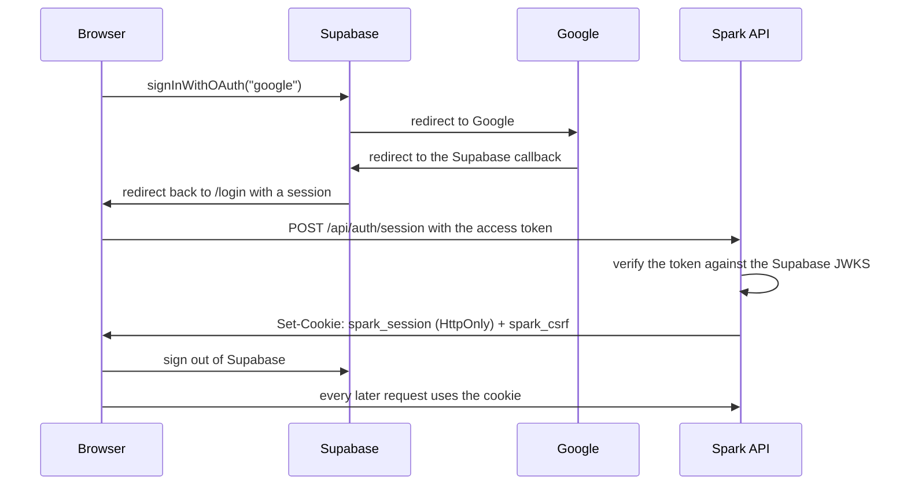

# Google sign-in

How Spark authenticates people, and exactly what to configure.

Most of Spark needs no account. Sign-in exists for organizations, private
datasets, custom models and API keys.

## How it works



Why the token is exchanged for a cookie rather than kept:

- The session cookie is `HttpOnly`, so no script on the page can read it. A
  token in `localStorage` can be read by any script that gets injected.
- The session lives on the Spark server, so signing out really ends it rather
  than just clearing one tab.
- Unsafe methods also need a CSRF header matching a second, readable cookie, so
  a cross-site form post cannot act as you.

The Supabase session is cleared as soon as the exchange succeeds. Spark never
stores a Google token.

## The exact URLs

Everything below depends on two values you choose:

| Placeholder | Example | Where it comes from |
| ----------- | ------- | ------------------- |
| `<project-ref>` | `abcdefghijklmnopqrst` | The subdomain of your Supabase project URL |
| `<your-domain>` | `spark.spacesdrive.cc` | Where the dashboard is served |

### Google Cloud Console

**Authorized redirect URIs** (this is the one that must be exact):

```
https://<project-ref>.supabase.co/auth/v1/callback
```

Add this too only if you also run Supabase locally with the CLI:

```
http://127.0.0.1:54321/auth/v1/callback
```

This is the Supabase callback, not a Spark URL. Google talks to Supabase, and
Supabase talks to the browser. Spark is never a party to the Google exchange.

**Authorized JavaScript origins:**

```
https://<project-ref>.supabase.co
```

Add your own origins as well if you later switch to Google One Tap, which runs
in the page rather than through a redirect:

```
https://<your-domain>
http://localhost:5173
```

The plain redirect flow used here does not need them, but adding them is
harmless.

### Supabase dashboard

**Authentication, Providers, Google**

| Field | Value |
| ----- | ----- |
| Enabled | on |
| Client ID | from the Google credential you created |
| Client Secret | from the same credential |

**Authentication, URL Configuration**

| Field | Value |
| ----- | ----- |
| Site URL | `https://<your-domain>` |
| Redirect URLs | `https://<your-domain>/login` and `http://localhost:5173/login` |

The redirect URL is `/login` because that is where the dashboard finishes the
flow: `signInWithGoogle` passes `${window.location.origin}/login` as
`redirectTo`, and the app exchanges the token on load. If you change that in
`web/src/pages/Login.tsx`, change it here too.

### Spark environment

In `.env`:

```
SUPABASE_URL=https://<project-ref>.supabase.co
SUPABASE_ANON_KEY=<the anon key>
SESSION_SECRET=<generate one, see below>
```

Generate the session secret:

```bash
python -c "import secrets; print(secrets.token_urlsafe(48))"
```

Only set `SUPABASE_JWT_SECRET` if your project still signs tokens with the
older shared HS256 secret. Newer projects publish public keys and need nothing
here.

For production also set:

```
ENVIRONMENT=production
COOKIE_SECURE=true
FRONTEND_URL=https://<your-domain>
BACKEND_URL=https://<your-domain>
CORS_ORIGINS=https://<your-domain>
```

Set `COOKIE_DOMAIN=.<your-root-domain>` only if the API and the dashboard sit
on different subdomains. With a single origin behind one reverse proxy, leave
it empty.

## Setting it up, step by step

1. Open the Google Cloud Console and create or pick a project.
2. Go to APIs and Services, OAuth consent screen. Choose External unless
   everyone signing in is in your Workspace. Fill in the app name, the support
   email and the developer email. Add the `email` and `profile` scopes. Nothing
   else is needed.
3. Go to Credentials, Create Credentials, OAuth client ID. Choose Web
   application.
4. Under Authorized redirect URIs, add
   `https://<project-ref>.supabase.co/auth/v1/callback`.
5. Under Authorized JavaScript origins, add
   `https://<project-ref>.supabase.co`.
6. Create it, then copy the Client ID and the Client Secret. The secret is
   shown once.
7. In the Supabase dashboard, open Authentication, Providers, Google. Turn it
   on and paste the Client ID and Client Secret.
8. In Authentication, URL Configuration, set the Site URL and add both redirect
   URLs from the table above.
9. Put `SUPABASE_URL`, `SUPABASE_ANON_KEY` and `SESSION_SECRET` into `.env`.
10. Restart the API and check `GET /api/health` reports
    `"auth_configured": true`.
11. Open the dashboard and press Continue with Google.

While the consent screen is in Testing mode, only accounts listed under Test
users can sign in. Publish it when you are ready for anyone.

## Verifying the token

Spark verifies the signature itself rather than trusting the token.

Newer Supabase projects sign with ES256 or RS256 and publish the public keys
at:

```
https://<project-ref>.supabase.co/auth/v1/.well-known/jwks.json
```

Spark fetches that key set and caches it for ten minutes, which is what
Supabase caches it for at the edge. Caching it longer would break key rotation.

Projects still on the legacy shared secret sign with HS256, which needs
`SUPABASE_JWT_SECRET`. If neither path works, Spark falls back to asking
Supabase who the token belongs to, which costs a network round trip and is why
it is not the default.

The issuer is checked in every case:

```
https://<project-ref>.supabase.co/auth/v1
```

A token from a different project is rejected.

## What is stored

| Table | Holds |
| ----- | ----- |
| `users` | The Supabase user id, the email, a display name and an avatar URL |
| `sessions` | A session id, its CSRF token, when it expires, and whether it was revoked |

No password, no Google token and no refresh token is ever stored. Identity
lives in Supabase.

Sessions expire after `SESSION_TTL_HOURS`, which defaults to a week. Signing out
marks the session revoked on the server.

## Authorization

Authentication says who you are. Authorization decides what you may touch, and
it always happens on the server.

- Every private row carries an `organization_id`.
- Every lookup by an id from a request goes through a function that checks
  membership first.
- A missing membership and a missing record both return 404, so the API cannot
  be used to discover which ids exist.
- An API key resolves to exactly one organization, and cannot reach another
  one's data.

Hiding a link in the sidebar is a convenience. It is never the control.

`tests/api/test_endpoints.py` includes a test that signs in as one user, creates an
organization, then signs in as another user who knows the id and asks for the
organization, its keys, its usage, its datasets and its jobs. Every one comes
back 404.

## When sign-in is not configured

`GET /api/health` reports `"auth_configured": false`, the login page explains
that the server has no Supabase project, and every route that needs an account
says so. Nothing else changes: scoring, dataset testing and the whole
evaluation keep working.
