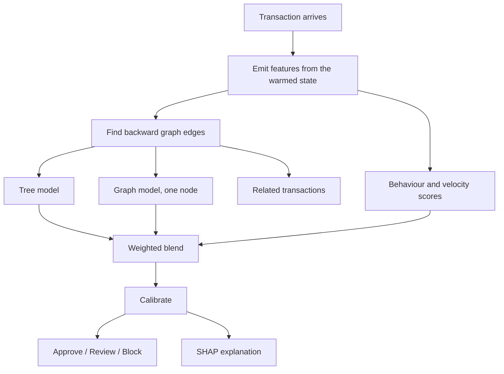
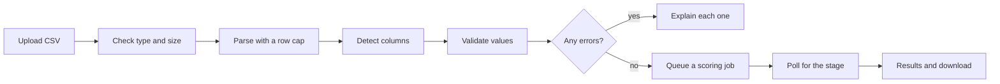

# Dashboard

The web interface around the Spark models.

## What it is for

A person opens Spark and, without an account, can:

1. Read what Spark does and what it scored.
2. Score one transaction and see why it got that score.
3. Upload a CSV and score every row in it.
4. Measure accuracy on their own data, if the file says what actually happened.

An account is only needed to create an organization, train a model, keep
private models, and issue API keys.

## Running it

Two processes: the API and the dashboard.

```bash
# once
pip install -r requirements.txt
cp .env.example .env

# terminal 1
uvicorn api.main:app --reload

# terminal 2
cd web
npm install
npm run dev
```

Open http://localhost:5173.

The dev server forwards `/api` to the API on port 8000, so the browser sees one
origin. That keeps the session cookie same-site in development, exactly as it is
in production behind the reverse proxy.

The API loads the model at startup, which takes a few seconds. Set
`EAGER_MODEL_LOAD=false` to skip that and load on the first scoring request
instead.

## Pages

| Page | Needs an account | What it does |
| ---- | ---------------- | ------------ |
| Overview | no | What Spark does, the measured results, and the limits |
| Test Transaction | no | Score one transaction and read the evidence |
| Test Dataset | no | Upload a CSV, score it, download results |
| Risk Analysis | no | The full evaluation, split by split |
| Abuse Rings | no | Detected rings and how they were scored |
| Models | no | Which models exist and what they scored |
| Train My Model | yes | Upload training data. Training itself is Upcoming |
| API | no | Endpoint reference |
| Sandbox | yes | Send a real request with a real test key |
| API Keys | yes | Create, rotate and revoke keys |
| Usage | yes | What your keys have been doing |
| Documentation | no | Plain-language guide and glossary |
| Settings | no | Theme, defaults, organizations, server state |

## How a transaction is scored

The batch pipeline scores rows by position: it builds every feature in one pass
and the graph model reads the whole graph at once. The API cannot do that,
because the transaction it is asked about did not exist when the file was
written.

`ml/serving/online.py` closes that gap without changing any model.



Three things make this exact rather than approximate:

1. A `CausalFeatureState` is replayed over the historical stream once, at
   startup. It ends up holding the accumulator state that existed after the
   last row of the file, so features for a new transaction are built the same
   way as every training feature.
2. Graph edges point back to the most recent earlier transactions sharing each
   entity value, using the same rule the batch graph builder uses.
3. The graph model is evaluated for the new node only. Because edges point
   strictly backwards, adding a node cannot change any earlier node's hidden
   state, so the cached activations stay valid.

`tests/test_serving.py` holds back the last row of the real dataset, replays
everything before it, then scores that row as if it had just arrived. The
features come out bit-identical and the graph score matches the batch score
exactly.

## Uploading a dataset



Scoring runs as a background job because a large file takes longer than an HTTP
request should. The progress bar shows the stage the server reported. It never
advances on a timer.

### Columns

The dashboard accepts friendly names and maps them. `GET /api/datasets/format`
returns the full table, and both the docs page and the validator read from that
one source, so they cannot drift apart.

| Column | Needed | Why |
| ------ | ------ | --- |
| Timestamp | required | Puts rows in order so each is scored using only what came before |
| Amount | required | Used directly, and compared with what this customer normally spends |
| Customer ID | required | How repeated behaviour and account age are measured |
| Merchant ID | required | Many customers hitting one merchant in a burst is the main ring signal |
| Location | recommended | One of the four graph links |
| Payment channel | recommended | One of the four graph links |
| Transaction ID | recommended | Identifies rows in the download |
| Label | optional | Needed only to measure accuracy |

Timestamps are converted to positions in a sequence, because the model counts
velocity in transactions rather than seconds.

### Labels

With labels, precision, recall, F1, PR-AUC, ROC-AUC, the confusion matrix and
the expected cost are all computed on your rows.

Without labels the dashboard says so and shows no accuracy numbers at all. This
distinction is deliberate and appears everywhere results are shown.

## What is not built yet

The dashboard marks these **Upcoming**, and the API refuses them with a clear
reason rather than pretending:

| Feature | State today |
| ------- | ----------- |
| Training a custom model | The account, organization, dataset and limit checks all run. `POST /api/training/jobs` then returns 501 with the list of checks that passed. |
| Model registry, promotion, rollback | The database tables and ownership rules exist. No candidate can be produced yet, so nothing can be promoted. |
| Continuous learning | Not started. |
| Device and IP fields | The source data has neither, so the model cannot use them. Adding them means retraining on a dataset that has them. |
| Python and Node SDKs | The API is plain JSON over HTTP. No package is published. |

## Design

The interface follows Fluid Functionalism: motion is spring-shaped and always
points at something, interactive surfaces respond before the click, and nothing
animates for decoration.

Concretely:

- Every transition either shows state changing or shows something arriving.
- Hover gives a 1px lift and a border change, so a control reads as responsive
  without shifting the layout.
- `prefers-reduced-motion` removes all of it.

Accessibility rules that are enforced, not aspirational:

- Risk level is always stated in words. `HIGH RISK`, not just a red card.
- Every focusable element has a visible focus ring.
- Charts label their values as well as colouring them.
- Wide tables scroll inside their own container, so the page never scrolls
  sideways.
- There is a skip link to the main content.

## Tests

```bash
cd web
npm run typecheck   # tsc, no errors
npm run lint        # eslint, no errors
npm test            # vitest
```

The frontend tests cover the parts that must not regress regardless of styling:
the API client turns backend errors into readable messages, a value that was not
measured never renders as zero, risk is stated in words as well as colour, and
the navigation has no duplicate or dead entries.
