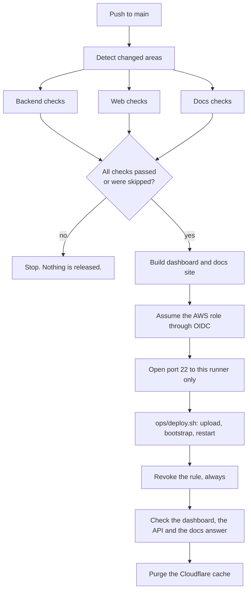

# Continuous integration and delivery

Spark ships through GitHub Actions. Two workflows do the work, and three
reusable ones hold the parts they share.

| Workflow | Runs on | What it does |
| --- | --- | --- |
| `ci.yml` | Pull requests, and pushes to any branch except `main` | Validates whatever changed. Never deploys. |
| `deploy.yml` | Pushes to `main` | Validates whatever changed, then releases to the origin. |
| `_changes.yml` | Called by both | Works out which areas a change touched |
| `_checks-backend.yml` | Called by both | Compiles, imports, runs the full test suite, scans for secrets |
| `_checks-web.yml` | Called by both | Lint, type check, tests, production build |
| `_checks-docs.yml` | Called by both | Builds the documentation site, checks every dashboard link resolves |

## What triggers what

Change detection is a `git diff` between the base and the head of the event,
so a run only pays for the areas that moved.

| Paths changed | Backend checks | Web checks | Docs checks | Deploys |
| --- | --- | --- | --- | --- |
| `api/`, `ml/`, `spark/`, `tests/`, `sdk/python/`, `requirements*.txt`, `pyproject.toml` | yes | no | no | yes |
| `web/`, `sdk/node/` | no | yes | no | yes |
| `docs/`, `ops/site/` | no | no | yes | yes |
| `ops/` (anything else) | no | no | no | yes |
| `README.md`, or anything not listed | no | no | no | no |

A documentation-only change still deploys, because the documentation site is
served from the origin and a page nobody can read is not published. A README
edit deploys nothing.

## Release flow



The release path is `ops/deploy.sh`, which is the same script a maintainer runs
by hand. There is one way to ship, not two.

## Why the deployment looks like this

The origin is a single EC2 instance behind Cloudflare. nginx there serves the
dashboard, the documentation site and `/api` from one hostname. That is not
incidental: the session cookie is `SameSite`, so moving the dashboard to a
different origin from the API would break sign-in. The pipeline therefore
builds the frontend and ships it to that origin rather than to a separate
static host, and finishes by purging the Cloudflare cache so visitors get the
new build.

The security group allows SSH from the maintainer's address and nothing else. A
GitHub runner has a different address every run, so the release opens port 22
for that one address, deploys, and revokes the rule in a step marked `always()`
so a failed deploy still closes the door.

## Required GitHub configuration

### Secrets

| Name | What it is |
| --- | --- |
| `AWS_DEPLOY_ROLE_ARN` | ARN of the IAM role the workflow assumes through OIDC |
| `SPARK_SSH_KEY` | Contents of the EC2 private key, the whole PEM including both header lines |
| `CLOUDFLARE_API_TOKEN` | Token with `Zone.Cache Purge` on the Spark zone |

### Variables

| Name | Value for this project |
| --- | --- |
| `AWS_REGION` | `ap-south-1` |
| `SPARK_EC2_NAME_TAG` | `spark-api` |
| `SPARK_SECURITY_GROUP_NAME` | `spark-api-sg` |
| `SPARK_PUBLIC_HOST` | `spark.spacesdrive.cc` |
| `SPARK_DOCS_HOST` | `docs-spark.spacesdrive.cc` |
| `CLOUDFLARE_ZONE_NAME` | `spacesdrive.cc` |

Variables hold everything that is not sensitive, so the workflow logs stay
readable and only three real secrets exist. Nothing is hardcoded in the
repository.

### The `production` environment

The release job targets an environment named `production`. Create it under
Settings, Environments. Adding required reviewers there turns every release
into a manual approval without touching the workflow.

## Setting up AWS OIDC

Long-lived AWS keys are not used. GitHub mints a short-lived token for each
run, and AWS trusts it for one repository and one branch.

Create the identity provider once per account:

```bash
aws iam create-open-id-connect-provider \
  --url https://token.actions.githubusercontent.com \
  --client-id-list sts.amazonaws.com
```

Then a role whose trust policy names this repository and only the `main`
branch, so a pull request from a fork cannot assume it:

```json
{
  "Version": "2012-10-17",
  "Statement": [{
    "Effect": "Allow",
    "Principal": {
      "Federated": "arn:aws:iam::<account-id>:oidc-provider/token.actions.githubusercontent.com"
    },
    "Action": "sts:AssumeRoleWithWebIdentity",
    "Condition": {
      "StringEquals": {
        "token.actions.githubusercontent.com:aud": "sts.amazonaws.com",
        "token.actions.githubusercontent.com:sub": "repo:spacesdrive/spark:ref:refs/heads/main"
      }
    }
  }]
}
```

The permissions the role needs are the two lookups and the two security group
edits, and nothing else. It cannot start, stop, modify or terminate anything:

```json
{
  "Version": "2012-10-17",
  "Statement": [
    {
      "Sid": "FindTheOrigin",
      "Effect": "Allow",
      "Action": [
        "ec2:DescribeInstances",
        "ec2:DescribeSecurityGroups"
      ],
      "Resource": "*"
    },
    {
      "Sid": "OpenAndCloseSshForOneRun",
      "Effect": "Allow",
      "Action": [
        "ec2:AuthorizeSecurityGroupIngress",
        "ec2:RevokeSecurityGroupIngress"
      ],
      "Resource": "arn:aws:ec2:<region>:<account-id>:security-group/<security-group-id>"
    }
  ]
}
```

`ec2:Describe*` cannot be scoped to a resource, which is why it is the one
wildcard. The two write actions are pinned to the single security group.

## Security properties

* Pull requests run through `pull_request`, not `pull_request_target`, so a
  fork's code never runs with access to secrets.
* Deployment is bound to `push` on `main`. There is no path from a pull request
  to production.
* Only the release job requests `id-token: write`. Everything else runs with
  `contents: read`.
* Event data reaches shell steps through the environment, never through direct
  interpolation, so a branch or commit message cannot inject a command.
* The SSH key is written from an environment variable to a file with mode 600
  and deleted in a step marked `always()`. It is never an argument, so it never
  reaches the process list.
* Only actions published by GitHub and by AWS are used.
* A failed check cannot be skipped: the release job tests each result
  explicitly rather than relying on the default, because it has to run when a
  check was skipped for being irrelevant.

## Running the same checks locally

```bash
python -m pytest                       # backend
python -m ops.checks.secret_scan       # secrets
python -m ops.site.build_docs          # documentation site
npm --prefix web ci
npm --prefix web run lint
npm --prefix web run typecheck
npm --prefix web run test
npm --prefix web run build
```
