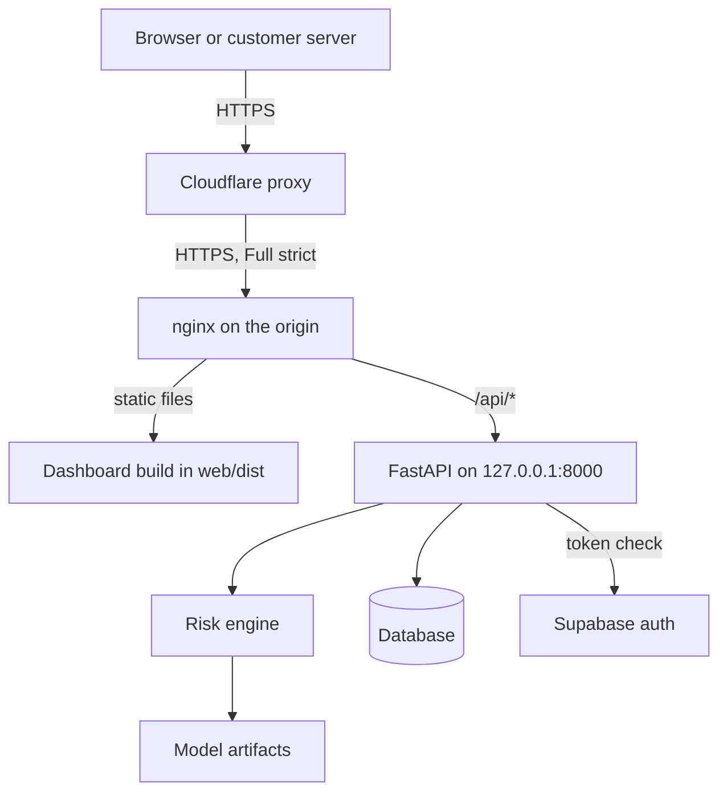

# Deployment

How Spark runs in production, and how to rebuild it from nothing.

Every value here is real and was verified against the running system. No
credential appears in this file, and none should ever be added to it.

## What is running

| Piece | Value |
| --- | --- |
| Dashboard and API | `https://spark.spacesdrive.cc` |
| Documentation host | `https://docs-spark.spacesdrive.cc` |
| Region | `ap-south-1` (Mumbai) |
| Instance | `i-0f6b5a71047ea690a`, `t3.small`, Ubuntu 24.04 LTS |
| Elastic IP | `13.232.127.102` |
| Security group | `sg-049ff0e1591e20ff2` (`spark-api-sg`) |
| Application root | `/opt/spark` |
| Service | `spark-api.service`, uvicorn on `127.0.0.1:8000` |
| Reverse proxy | nginx, TLS on 443, redirect on 80 |
| Certificate | Let's Encrypt, renewed by `certbot.timer` |
| Database | SQLite at `/opt/spark/data/spark.db` |
| Identity | Supabase project `kiiyqdefskiwqtmbywhf`, Google sign in |

## Shape



Cloudflare is not decorative here. The security group accepts ports 80 and 443
only from Cloudflare's published ranges, so the origin cannot be reached
directly and the proxy cannot be bypassed. Port 22 is open only to the address
that provisioned the host.

## Why the hostname is `docs-spark` and not `docs.spark`

Cloudflare's Universal SSL covers the apex and one level of subdomain. A name
two levels deep, such as `docs.spark.spacesdrive.cc`, is served with a
certificate no browser accepts, and the request fails before it reaches the
origin. This was measured, not assumed: the two level name returned a TLS
failure while the one level name returned 200.

Using `docs-spark.spacesdrive.cc` keeps it inside the covered set. The two
level name would need Cloudflare's Advanced Certificate Manager, which is a
paid add on.

## Rebuilding from nothing

Each script prints its plan and changes nothing until `--apply`. All of them
are safe to run twice: they look resources up by tag or name and reuse what is
already there.

```bash
# 1. Database schema in Supabase, inside a dedicated "spark" schema.
python -m ops.supabase.push            # plan
python -m ops.supabase.push --apply

# 2. Supabase keys into .env, and Spark's OAuth redirect URLs.
python -m ops.supabase.env --apply

# 3. AWS: security group, instance, Elastic IP.
python -m ops.aws.provision            # plan
python -m ops.aws.provision --apply

# 4. DNS.
python -m ops.cloudflare.dns <origin-ip> --apply

# 5. Application.
export SPARK_KEY=/path/to/key.pem SPARK_HOST=<origin-ip>
python -m ops.server.env --host "$SPARK_HOST" --key "$SPARK_KEY"
bash ops/deploy.sh

# 6. Certificate and TLS.
bash ops/server/tls.sh                 # runs on the server
```

## Redeploying a change

```bash
export SPARK_KEY=/path/to/key.pem
bash ops/deploy.sh
```

That builds the dashboard locally, uploads the code, reinstalls anything that
changed and restarts the service. It never copies `.env` or any key directory,
so server secrets survive a deploy untouched.

## Surviving a restart

The public address is an Elastic IP, so stopping and starting the instance
keeps it. Nothing in the frontend or in DNS holds a hardcoded address, and no
step needs repeating after a reboot.

If your own address changes and SSH stops working:

```bash
python -m ops.aws.provision --refresh-ssh
```

## Certificate renewal

Certbot renews through a DNS-01 challenge, because port 80 is closed to
everything except Cloudflare and an HTTP challenge could never complete.
`certbot.timer` handles it. To check:

```bash
sudo certbot certificates
sudo systemctl list-timers certbot.timer
```

## Moving from SQLite to Supabase PostgreSQL

The `spark` schema and all nine tables already exist in Supabase. Connecting to
them needs the project's PostgreSQL password, which the Management API cannot
reveal and which was deliberately not reset, because another application shares
that project and a reset would break it.

To switch:

1. Copy the database password from the Supabase dashboard.
2. Add `SUPABASE_DB_PASSWORD=...` to the local `.env`.
3. Run `python -m ops.server.env --host ... --key ...`, which builds the
   connection string, pins `search_path` to `spark` and rewrites the server
   environment file.
4. Restart: `sudo systemctl restart spark-api`.

`/api/health` reports which engine is actually in use, so the switch is
verifiable rather than assumed.

## Health

```bash
curl https://spark.spacesdrive.cc/api/health
```

```json
{
  "status": "ok",
  "environment": "production",
  "model": { "loaded": true, "model_version": "spark-hybrid-v1" },
  "database": { "ok": true },
  "auth_configured": true
}
```

The first start after a deploy takes about 80 seconds, because the risk engine
replays the historical transactions to rebuild its feature state before it will
serve traffic. `systemctl is-active spark-api` reports active during that
window while `/api/health` is not yet answering, which is expected.

## Secrets

The three key directories are local sources only. They are listed in
`.gitignore`, are never copied to the server by `ops/deploy.sh`, never appear
in a log line, and are never returned by an endpoint. The server holds only
`/opt/spark/.env`, mode `640`, owned by `ubuntu:spark`.
