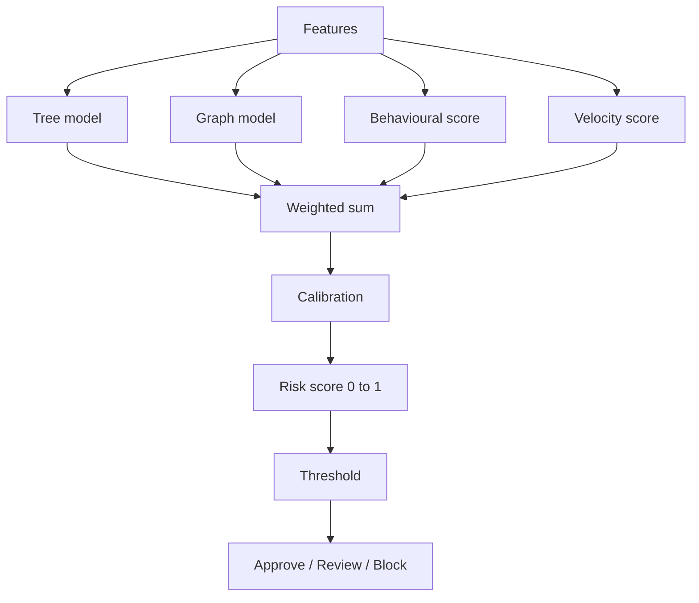

# Model

Four scores are produced for every transaction, then combined into one.



## Features

About 144 values built from 6 raw columns. Two groups.

### Base features (124), no labels used

| Type | Examples |
| ---- | -------- |
| Amount | the amount, its log, whether it is a round number |
| Velocity | how many transactions in the last 20, 100, 500, 2000 steps |
| History | how many transactions this account has made, how long since the last one, how old the account is |
| Deviation | how far the amount is from this account's normal |
| Fan | how many different merchants this account touched, how many different accounts touched this merchant |
| Burst | current rate compared with this entity's own normal rate |

### Risk features (20), labels used carefully

| Feature | Meaning |
| ------- | ------- |
| Known outcomes | how many confirmed results this merchant has so far |
| Known frauds | how many of them were fraud |
| Risk rate | the smoothed fraud rate for this entity |

These only count outcomes that were already confirmed before this transaction,
and only after a delay. See the delay section below.

## Baseline model: LightGBM

A gradient boosted tree. It builds many small decision trees, each fixing the
mistakes of the previous ones.

Why I chose it:

- It works well on table shaped data.
- It handles 124 features without much tuning.
- It trains in a few seconds on CPU.
- SHAP gives exact per-feature explanations for it.

What it predicts: the chance that this transaction is fraud.

It only sees the base features. It never sees a fraud count. That is
deliberate. If both models saw the same signals, combining them would be
pointless.

Code: `ml/models/tabular.py`

## Graph model

A small neural network that passes information along graph connections.

For each transaction it does this, twice:

```
new values = activate(
    W_self * own features
    + W_customer * average of neighbours sharing a customer
    + W_merchant * average of neighbours sharing a merchant
    + W_location * average of neighbours sharing a location
    + W_channel  * average of neighbours sharing a channel
)
```

Because connections only point from older to newer, doing this twice lets a
transaction see two steps into its own past, and never into the future.

It sees the base features, the risk features, and counts of confirmed fraud
among its neighbours. 171 inputs in total, 75,649 parameters.

Written in plain PyTorch with sparse matrices. It runs full batch on CPU in
about 50 seconds.

Code: `ml/models/graph_nn.py`

## The two simple scores

Neither uses fraud labels at all.

**Behavioural score.** Combines: how far the amount is from this account's
normal, whether this is a new merchant for them, whether this is a new channel,
and whether the account is brand new.

**Velocity score.** Combines: how much busier this account is than usual, how
much busier this merchant is than usual, and how many different accounts are
converging on the same merchant or channel.

Each one combines its signals into a raw number, then converts that number into
its percentile against the training data. So an output of 0.97 means "more
extreme than 97% of normal traffic". That makes it a number you can mix with a
probability.

They exist because both learned models depend on history and on fraud labels
arriving. These two do not, so they hold up when the feedback is slow.

Code: `ml/models/components.py`

## Training

```bash
python -m ml.training.train
```

Order:

1. Load and check the data, split it by time.
2. Build the graph.
3. Train the tree model on train, stop early using validation.
4. Train the graph model on train, stop early using validation.
5. Fit the two simple scores on train.
6. Search the combining weights on validation.
7. Calibrate on validation.
8. Pick the thresholds on validation.
9. Find rings.
10. Save everything to `artifacts/`.

Total: about 70 seconds.

The test split is not touched anywhere in this step.

## Validation

Validation data is used for every choice that is not a model weight:

- When to stop training each model.
- The four combining weights.
- The calibration curve.
- The three thresholds.

Using validation for this is what keeps the test data clean.

## Test

The test split is read in one file, `ml/evaluation/evaluate.py`, after
everything above is frozen. Nothing is refitted there.

## Combining the four scores

The four scores are added with weights:

```
risk = w1*tree + w2*graph + w3*behavioural + w4*velocity
```

The weights are searched, not guessed. 400 combinations were tried on the
validation data, including equal weights and every single-model corner.

| | tree | graph | behavioural | velocity | validation PR-AUC |
| --- | --- | --- | --- | --- | --- |
| A sensible guess | 0.450 | 0.350 | 0.100 | 0.100 | 0.5110 |
| Searched | 0.267 | 0.561 | 0.000 | 0.172 | 0.5308 |

The search more than doubled the graph weight and dropped the behavioural score
to zero, because it mostly repeats what the tree model already sees.

Code: `ml/calibration/fuse.py`

## Calibration

Calibration makes the risk score match the real chance of fraud.

Before calibration, a score of 0.8 only means "riskier than 0.7". After
calibration, roughly 80% of transactions scoring near 0.8 should be fraud.

The method here is isotonic regression, fitted on the validation data. It
learns a curve that only ever goes up, mapping raw scores onto observed fraud
rates.

This matters because the thresholds are chosen by expected cost. If the
probabilities are wrong, the cost calculation is wrong, and so is the
threshold.

Measured on validation, calibration improved the Brier score from 0.1107 to
0.0736. Lower is better.

Note: calibration drifts. Between validation and test the score distribution
moved a lot here (PSI 0.86). In real use you would recalibrate regularly.

## Risk score

A number between 0 and 1. Higher means more likely to be fraud.

## Threshold

Two cut-off points turn the score into a decision. They are picked on
validation by minimising expected cost:

```
cost = false positives    * 25.0
     + missed fraud       * (amount + 15.0)
     + reviewed fraud     * 20% of (amount + 15.0)
     + reviews            * 3.0
```

Reviewing catches 80% of the fraud sent to it, so 20% still gets through.

A threshold must also fire on at least 100 validation transactions. Without
that rule, the high precision search picks a point far out in the tail that
fires on almost nothing.

Three settings are produced:

| Setting | How it is chosen |
| ------- | ---------------- |
| balanced | lowest expected cost |
| high_precision | cheapest point reaching 0.90 precision |
| high_recall | cheapest point reaching 0.80 recall |

## Decision

```
score below the review threshold        APPROVE
between review and block thresholds     REVIEW
at or above the block threshold         BLOCK
```

On this dataset the balanced setting blocks at 0.1402 and reviews from 0.0771.

## Explanations

Every decision comes with reasons.

- SHAP over the tree model gives the exact per-feature contributions.
- The channel share shows how much each of the four scores moved the result.
- If the transaction belongs to a ring, the ring is named.

The wording is always "contributed to the risk score", never "caused". A test
checks that no explanation uses causal language.

Code: `ml/evaluation/explain.py`

## The chargeback delay

The biggest assumption in the project: how fast does a merchant learn that a
payment was fraud?

Risk features depend on it. If confirmations are instant, they are very
powerful. In real life chargebacks arrive weeks later.

The delay is a setting, not a hidden default. Measured on the held-out test:

| Delay | Test PR-AUC | Ring precision | Ring recall |
| ----- | ----------- | -------------- | ----------- |
| 0 (instant, optimistic) | 0.8827 | 0.9189 | 0.8963 |
| 500 | 0.8419 | 0.9189 | 0.8963 |
| 2000 (the default) | 0.9151 | 0.9189 | 0.8963 |
| 6000 | 0.8365 | 0.9189 | 0.8963 |

Two things to read here.

The full system barely moves. That is because the graph model and the two
label-free scores carry the load when risk counts go stale. A tree-only model
over the same features swings from 0.96 down to 0.73 across the same range.

The ring numbers do not move at all, because ring detection reads no labels.
That is the point of having it.

Run it yourself with `python -m ml.evaluation.sensitivity`.
