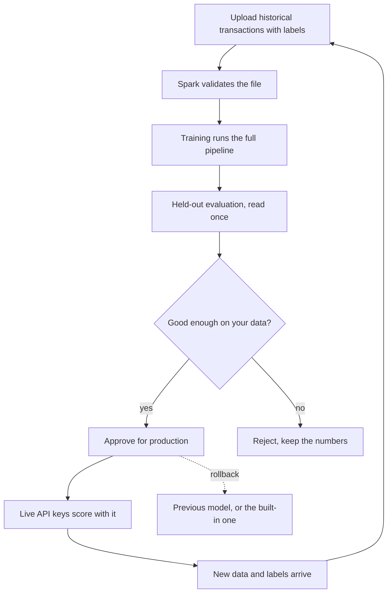

# Training your own model

Spark can fit a model to your own historical transactions. It uses the same
pipeline as the built-in model, with the same split discipline, so the result
is measured the same way rather than graded on a curve.

Training never touches your live traffic. It produces a candidate. A person
approves it.

## The loop

## What you need

A CSV of transactions with a label column saying what actually happened: 1 for
fraud or abuse, 0 for normal. Rows you are unsure about can be left blank; they
are kept for building history but are not used as training targets.

| Requirement | Value |
| --- | --- |
| Smallest dataset | 2,000 labeled rows |
| Largest dataset | 200,000 rows |
| Largest upload | 25 MB |
| Format | CSV |

Only about a quarter of rows in a typical file carry a confirmed outcome, so a
file needs to be considerably larger than the minimum to clear it. The API says
exactly how many usable labels it found when it refuses.

## What training does

Nine stages, in order, and the page reports the one it is on:

1. **prepare** builds the causal features. Every feature is computed from what
   was known *before* each transaction, never after.
2. **graph** links transactions that share a customer, merchant, location or
   payment type. Links only ever point backwards in time.
3. **tabular model** fits a gradient boosted tree.
4. **graph model** fits a relational graph network.
5. **unsupervised channels** fit two scores that need no labels.
6. **fusion** searches 400 weight combinations on validation data and
   calibrates the blend.
7. **thresholds** picks review and block cuts by cost, on validation data.
8. **rings** looks for coordinated groups.
9. **persist** writes the model.

Progress moves when a stage finishes, not on a timer. If a run stalls, the bar
stops. That is deliberate.

## Held-out results

After training, Spark evaluates the model on a split it has never seen, read
once, after every weight and threshold is already fixed. Those are the only
numbers shown, and the only ones a model can be approved on.

You get PR-AUC, ROC-AUC, precision, recall, F1 and false positive rate, plus
the confusion counts behind them.

Training scores are deliberately not displayed. A model always looks good on
data it memorised, and approving on that basis is the mistake the held-out
split exists to prevent.

## Comparing models

`GET /api/organizations/{id}/model-comparison` lists your trained models,
ranked by held-out PR-AUC.

Two warnings come back with it, because they matter more than the ranking:

* Models trained on **different datasets are not comparable**. A higher score
  may only mean an easier test split. The response flags this.
* The **built-in model is not in the table**. It was measured on a different
  dataset, so ranking it alongside yours would invite a comparison that cannot
  honestly be made. Compare your model against your own data, and decide
  whether it is good enough for your traffic.

## Approving for production

Approving a model is different from selecting it in the dashboard.

| Action | What changes |
| --- | --- |
| **Activate** | What this dashboard scores with. Affects only what you see. |
| **Approve** (promote) | What **live API keys** resolve to. Affects real traffic. |

A model cannot be approved unless it finished training and has held-out
results. This is enforced by the API, not just hidden in the interface.

Approving also unlocks live API key creation. Until an organization has an
approved model, `POST /organizations/{id}/api-keys` with `mode: "live"` is
refused with `no_production_model`. Test keys are unaffected and always
available.

## Rolling back

`POST /api/organizations/{id}/rollback` returns production to whatever it was
before the last approval.

If there was no earlier custom model, production returns to the built-in model
and your live keys keep working. That is a real outcome and is reported as
such, not treated as a failure.

If the model it would roll back to has since been rejected, Spark falls back to
the built-in model rather than leaving the current one in place. A rollback
that reports success must actually change something.

## Test keys never follow production

A test key always resolves to the built-in model, whatever you have approved.
Sandbox traffic therefore cannot be affected by a promotion or a rollback, and
cannot be used to probe what an organization is running in production.

## Continuous learning

The loop above is the learning loop, and every step of it works today: new
labeled data goes in, a candidate is trained, it is evaluated on held-out data,
compared, and then approved or rejected.

What is **not** built is the scheduler. Nothing runs a retraining job for you
overnight; you start each round yourself. There is no cron process in the
deployment, and pretending otherwise would mean a dashboard claiming a model
was refreshed when nothing had run.

**Status: retraining Available, automatic scheduling Upcoming.**

## Where your data lives

A model is stored with the exact CSV it was fitted on, in a directory named by
an id the server generated. That copy is what makes a model reproducible and
what the held-out evaluation is computed against.

Uploaded files are stored under a random name, never the one you chose. They
are never executed and never loaded as Python objects. Nothing you upload is
used to train anything for anyone else.
